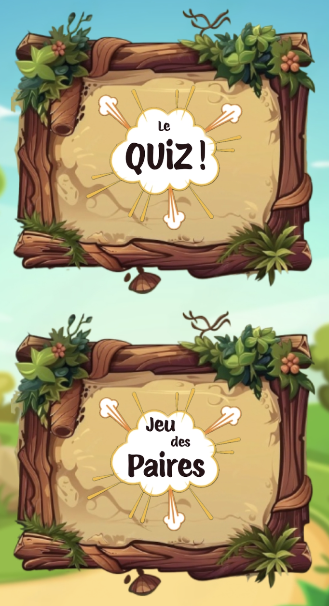
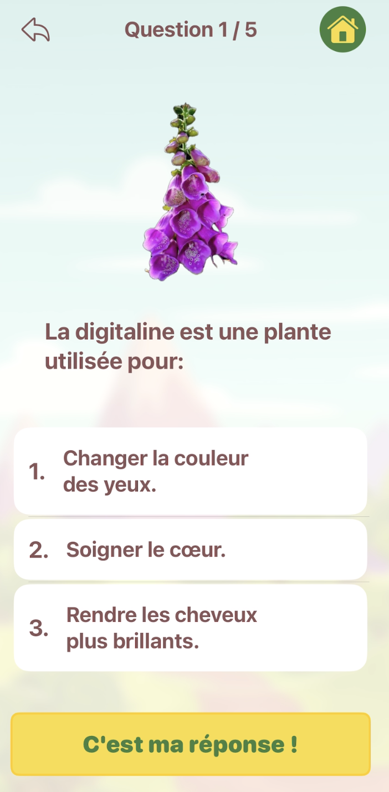
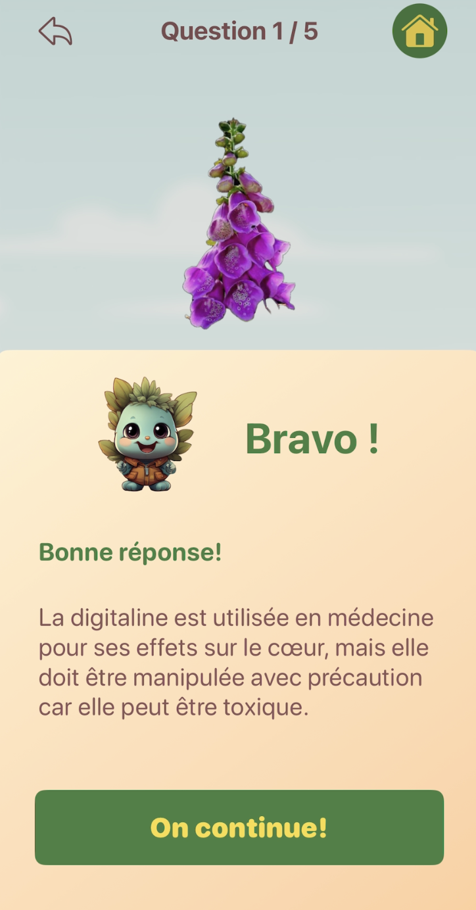

# 🌱 Greeny


**Greeny** est une application iOS éducative qui sensibilise les enfants à la flore et à la biodiversité à travers des mini-jeux ludiques.
Le joueur découvre différentes plantes, apprend à les reconnaître et gagne des badges en progressant.

---

## 🎮 Fonctionnalités principales

* **Quiz** : questions aléatoires sur la flore, avec choix de réponses, validation instantanée, affichage des bonnes réponses et suivi du score.
* **Jeu d’association** : associer correctement une image de plante à son nom.
* **Le Jardin** : espace de collection où le joueur retrouve les plantes “débloquées” et peut en apprendre davantage.

---

## 🚀 Objectif

Offrir un moyen ludique et éducatif de découvrir la biodiversité végétale et de sensibiliser les enfants à la richesse de la flore.

---

## 🤝 Projet collaboratif

Ce projet a été réalisé en équipe dans le cadre de l’**Apple Foundation Program**, organisé par **Simplon** en **septembre 2024**.
Les noms des autres participants ne sont pas mentionnés par respect de leur confidentialité.

---

## 👩‍💻 Ma contribution

J’ai principalement développé la **vue Quiz** et l’ensemble de la **logique interactive** associée :

* Affichage dynamique des questions aléatoires
* Gestion des réponses (bonne/mauvaise)
* Affichage de la correction
* Calcul et affichage du score en temps réel
* Intégration fluide avec le reste de l’application

---

## 📸 Aperçu

**Jeu :**



**Quiz :**





---

## 🧩 Technologies

* **Langage** : Swift
* **IDE** : Xcode
* **Plateforme** : iOS
* **Interface** : SwiftUI

---

## ⚙️ Installation et exécution

1. **Cloner le dépôt :**

   ```bash
   git clone https://github.com/tonpseudo/Greeny.git
   cd Greeny
   ```

2. **Ouvrir le projet dans Xcode :**

   * Double-clique sur `Greeny.xcodeproj`
   * Ou ouvre Xcode puis choisis *File → Open...* et sélectionne le dossier du projet.

3. **Lancer l’application :**

   * Sélectionne un simulateur iPhone dans la barre d’outils.
   * Clique sur le bouton ▶️ *Run* pour exécuter le projet.
